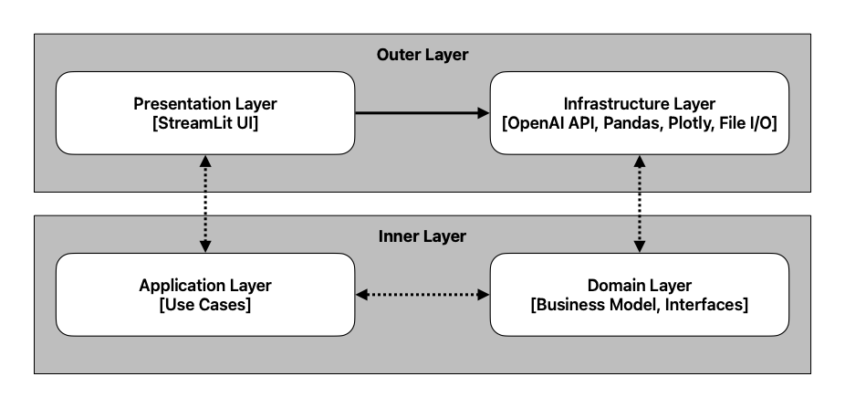
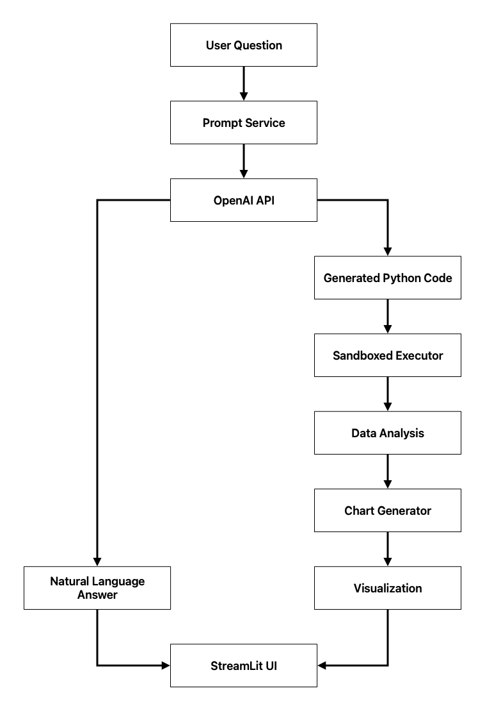

# AI-Powered Data Assistant 🤖

[](https://streamlit.io/)
[](https://www.python.org/)
[](https://openai.com/)

An intelligent web application that serves as an interactive data assistant, enabling users to ask natural language questions about datasets and receive automated analysis with visualizations powered by Large Language Models.

## 🎯 Project Overview

This project demonstrates the seamless integration of **Large Language Models (LLM)** with data analysis and visualization, following **Clean Architecture** principles and software engineering best practices. The application transforms complex data analysis tasks into simple conversational interactions.

### Key Features
- 🗣️ **Natural Language Processing**: Ask questions in English or Indonesian
- 🧠 **AI-Powered Analysis**: GPT-4o-mini generates intelligent insights and Python code
- 📊 **Automatic Visualizations**: Dynamic chart generation with Plotly
- 🔒 **Sandboxed Execution**: Safe code execution in controlled environment
- 🎨 **Modern UI**: Clean, responsive Streamlit interface
- 🏗️ **Clean Architecture**: Modular, testable, and maintainable codebase

## 🏗️ Clean Architecture

The application follows **Clean Architecture** principles with clear separation of concerns, ensuring maintainability, testability, and scalability:



### Architecture Benefits
- **Dependency Inversion**: Inner layers don't depend on outer layers
- **Testability**: Easy unit testing with mock dependencies
- **Maintainability**: Clear separation of concerns
- **Flexibility**: Easy to swap implementations (e.g., change LLM provider)

## 📁 Project Structure

```
ai-powered-data-assistant/
│
├── 📂 src/                                     # Source code
│   ├── 📄 config.py                            # Centralized configuration management
│   ├── 📂 presentation/                        # UI layer (Streamlit)
│   │   ├── 📄 app.py                           # Main application entry point
│   │   └── 📄 ui_components.py                 # Reusable UI components
│   │
│   ├── 📂 application/                         # Application logic layer
│   │   ├── 📂 use_cases/                       # Business use cases
│   │   │   └── 📄 process_question_use_case.py
│   │   └── 📂 services/                        # Application services
│   │       └── 📄 prompt_service.py
│   │
│   ├── 📂 domain/                              # Core business logic layer
│   │   ├── 📄 entities.py                      # Business entities (data models)
│   │   └── 📄 repositories.py                  # Abstract interfaces
│   │
│   └── 📂 infrastructure/                      # External concerns layer
│       ├── 📂 external/                        # External APIs
│       │   └── 📄 openai_client.py             # OpenAI API integration
│       ├── 📂 persistence/                     # Data access
│       │   └── 📄 csv_loader.py                # CSV data loading
│       ├── 📂 visualization/                   # Chart generation
│       │   └── 📄 plotly_chart.py              # Plotly integration
│       └── 📂 execution/                       # Code execution
│           └── 📄 code_executor.py             # Sandboxed code execution
│
├── 📂 data/                                    # Data files
│   └── 📄 superstore_data.csv                  # Sample dataset
│
├── 📂 prompts/                                 # Prompt templates
│   ├── 📂 application/                         # Application-level prompts
│   │   └── 📂 services/
│   │       ├── 📄 system_prompt.txt            # Application system prompt
│   │       └── 📄 analysis_prompt.txt          # Data analysis prompt
│   └── 📂 infrastructure/                      # Infrastructure-level prompts
│       └── 📂 external/
│           ├── 📄 builder_prompt.txt           # Code builder prompt
│           └── 📄 system_prompt.txt            # Infrastructure system prompt
│
├── 📂 logs/                                    # Log files (created automatically)
├── 📂 tests/                                   # Test suite (placeholder)
│   ├── 📂 unit/                                # Unit tests
│   └── 📂 integration/                         # Integration tests
│
├── 📄 .env.example                             # Environment variables template
├── 📄 .env                                     # Environment variables (git-ignored)
├── 📄 requirements.txt                         # Python dependencies
├── 📄 app.py                                   # Application entry point
└── 📄 README.md                                # This file
```

### Layer Responsibilities

| Layer | Responsibility | Key Components |
|-------|----------------|----------------|
| **🎨 Presentation** | User interface & interaction | Streamlit app, UI components |
| **⚙️ Application** | Business logic & orchestration | Use cases, services |
| **🧠 Domain** | Core business models & rules | Entities, interfaces |
| **🔧 Infrastructure** | External integrations | APIs, databases, file I/O |

## 🚀 Quick Start

### Prerequisites

- **Python 3.9+**
- **OpenAI API key** with GPT-4o-mini access
- **Git** for version control

### 🛠️ Installation

<details>
<summary>📋 Step-by-step installation guide</summary>

#### 1. **Clone the repository**
```bash
git clone <repository-url>
cd ai-powered-data-assistant
```

#### 2. **Create virtual environment**
```bash
# Using venv (recommended)
python -m venv venv
source venv/bin/activate  # On Windows: venv\Scripts\activate

# OR using conda
conda create -n ai-data-assistant python=3.9 -y
conda activate ai-data-assistant
```

#### 3. **Install dependencies**
```bash
pip install -r requirements.txt
```

#### 4. **Set up environment variables**
```bash
# Copy the template
cp .env.example .env

# Edit .env and add your OpenAI API key
# OPENAI_API_KEY=your_actual_openai_api_key_here
```

#### 5. **Verify installation**
```bash
# Check if everything is working
python -c "import streamlit, pandas, plotly, openai; print('✅ All dependencies installed successfully!')"
```

</details>

### ▶️ Running the Application

```bash
streamlit run app.py
```

🌐 **Access the application** at [http://localhost:8501](http://localhost:8501)

### 🐳 Docker Alternative (Optional)

```dockerfile
# Dockerfile (if you want to containerize)
FROM python:3.9-slim

WORKDIR /app
COPY requirements.txt .
RUN pip install -r requirements.txt

COPY . .
EXPOSE 8501

CMD ["streamlit", "run", "app.py", "--server.address=0.0.0.0"]
```

## 🛠️ Development

### 📦 Dependencies

The project uses the following key dependencies:

```python
# Core Framework
streamlit>=1.28.0      # Web application framework
pandas>=2.0.0          # Data manipulation
plotly>=5.15.0         # Data visualization
openai>=1.0.0          # LLM API integration
python-dotenv>=1.0.0   # Environment variable management
dependency-injector>=4.41.0  # Dependency injection
```

### 🧪 Testing & Code Quality

While the project structure includes test directories, the current implementation focuses on the core functionality. Future enhancements will include:

- **Unit Tests**: pytest with mocking
- **Integration Tests**: End-to-end workflow testing
- **Code Quality**:
  - **Black**: Code formatting (88-char line length)
  - **Ruff**: Linting and import sorting
  - **Type hints**: For better code documentation
  - **Docstrings**: For all public functions and classes

### 🔧 Development Setup

```bash
# For development with hot reload
streamlit run app.py --server.runOnSave true

# For debugging
streamlit run app.py --logger.level debug
```

### 📝 Code Style Guidelines

- **Clean Architecture**: Follow dependency inversion principle
- **Type Safety**: Use type hints for all function signatures
- **Documentation**: Comprehensive docstrings for all public APIs
- **Error Handling**: Graceful error handling with user-friendly messages
- **Security**: Sandboxed code execution, input validation

## ✨ Features & Capabilities

### 🎯 Core Features (MVP)

| Feature | Description | Implementation |
|---------|-------------|----------------|
| 🗣️ **Natural Language Processing** | Ask questions in English or Indonesian | OpenAI GPT-4o-mini integration |
| 🧠 **AI-Powered Analysis** | LLM generates intelligent insights and Python code | Custom prompt engineering |
| 🔒 **Sandboxed Code Execution** | Safe execution environment for generated code | Restricted Python globals |
| 📊 **Automatic Visualizations** | Dynamic chart generation based on analysis | Plotly with smart chart type detection |
| 🎨 **Three-Panel UI** | Answer, data, and visualization display | Streamlit columns layout |
| 🛡️ **Error Handling** | Comprehensive error management | Graceful degradation |
| 🏗️ **Clean Architecture** | Modular, maintainable codebase | Dependency injection |

### 📈 Supported Chart Types

The application intelligently selects the best visualization based on your question:

- **📊 Bar Charts** - Comparisons and rankings
- **📈 Line Charts** - Trends and time series data
- **🥧 Pie Charts** - Proportions and distributions
- **⚡ Scatter Plots** - Correlations and relationships

### 🧠 Smart Chart Detection

The system automatically suggests chart types based on keywords:

```python
# Line Charts: "trend", "over time", "timeline", "series"
# Bar Charts: "compare", "vs", "versus", "difference"
# Pie Charts: "proportion", "percentage", "share", "distribution"
# Default: Bar chart for general comparisons
```

## ⚙️ Configuration

The application uses a **centralized configuration management system** to handle all environment variables and settings. The configuration is managed through the `src/config.py` file, which provides:

- **Automatic loading** of environment variables from `.env` file
- **Streamlit secrets integration** for deployment environments
- **Flexible data source configuration** (local files or remote URLs)
- **Validation** of required configuration variables at startup
- **Type-safe access** to configuration values through properties
- **Clear error messages** for missing or misconfigured variables

### 🔧 Configuration Features

#### Streamlit Secrets Support
The configuration system automatically detects when running in Streamlit Cloud and prioritizes secrets over local environment variables:

```python
# In production (Streamlit Cloud): Uses st.secrets
# In development: Uses .env file
```

#### Flexible Data Sources
Support for both local and remote data sources:

```python
# Local file (default)
DATA_SOURCE_TYPE=local
DATA_FILE_PATH="data/superstore_data.csv"

# Remote URL
DATA_SOURCE_TYPE=url
DATA_FILE_URL="https://example.com/data.csv"
```

### 🔑 Environment Variables

Create a `.env` file based on `.env.example`:

```env
# OpenAI API Configuration (Required)
OPENAI_API_KEY=your_openai_api_key_here

# Application Configuration
APP_TITLE="AI-Powered Data Assistant"

# Data Source Configuration
# Data source type: "local" (file) or "url" (remote)
DATA_SOURCE_TYPE=local

# For local data source
DATA_FILE_PATH="data/superstore_data.csv"

# For remote data source (alternative to local)
# DATA_FILE_URL="https://example.com/data.csv"

# Path Configuration
PROMPTS_DIR="prompts"
LOG_DIR="logs"
BUILDER_PROMPT_PATH="prompts/infrastructure/external/builder_prompt.txt"
SYSTEM_PROMPT_PATH="prompts/infrastructure/external/system_prompt.txt"
APP_SYSTEM_PROMPT_PATH="prompts/application/services/system_prompt.txt"
ANALYSIS_PROMPT_PATH="prompts/application/services/analysis_prompt.txt"

# Development Settings
DEBUG=True
```

### 📋 Getting Your OpenAI API Key

1. Visit [OpenAI Platform](https://platform.openai.com/)
2. Sign up or log in to your account
3. Navigate to **API Keys** section
4. Create a new API key
5. Copy the key and add it to your `.env` file

> 💡 **Note**: You'll need an OpenAI account with credits to use GPT-4o-mini. The model is cost-effective for this application.

### ☁️ Streamlit Cloud Configuration

For deployment on Streamlit Community Cloud, configure your secrets in the dashboard:

#### Step 1: Add Secrets in Streamlit Dashboard
1. Go to your app's settings in Streamlit Cloud
2. Navigate to **Secrets** section
3. Add the following configuration:

```toml
# Streamlit Cloud Secrets Configuration
OPENAI_API_KEY = "your_openai_api_key_here"

APP_TITLE = "AI-Powered Data Assistant"

# Data source configuration
DATA_SOURCE_TYPE = "local"
DATA_FILE_PATH = "data/superstore_data.csv"

# Path configuration
PROMPTS_DIR = "prompts"
LOG_DIR = "logs"
BUILDER_PROMPT_PATH = "prompts/infrastructure/external/builder_prompt.txt"
SYSTEM_PROMPT_PATH = "prompts/infrastructure/external/system_prompt.txt"
APP_SYSTEM_PROMPT_PATH = "prompts/application/services/system_prompt.txt"
ANALYSIS_PROMPT_PATH = "prompts/application/services/analysis_prompt.txt"

# Development settings
DEBUG = "False"
```

#### Step 2: Upload Data Files
- Upload your CSV data files to the repository
- Ensure prompt template files are included in the deployment

#### Step 3: Automatic Configuration
The application will automatically detect the Streamlit environment and use secrets instead of environment variables.

> ✅ **Benefit**: No need to expose API keys or sensitive configuration in your code repository.

## 🚀 Deployment

### ☁️ Streamlit Community Cloud

The easiest way to deploy your application:

1. **📤 Push to GitHub**
   ```bash
   git add .
   git commit -m "Deploy AI Data Assistant"
   git push origin main
   ```

2. **🔗 Connect to Streamlit**
   - Visit [Streamlit Community Cloud](https://share.streamlit.io/)
   - Click "New app" and connect your GitHub repository
   - Select the repository and branch

3. **⚙️ Configure Deployment**
   - Set startup command: `streamlit run app.py`
   - Add environment variables in deployment settings
   - Specify Python version (3.9+ recommended)

4. **🚀 Deploy**
   - Click "Deploy" and wait for the build to complete

### 🐳 Docker Deployment

For containerized deployments:

```dockerfile
# Dockerfile
FROM python:3.9-slim

WORKDIR /app

# Install system dependencies
RUN apt-get update && apt-get install -y \
    build-essential \
    && rm -rf /var/lib/apt/lists/*

# Install Python dependencies
COPY requirements.txt .
RUN pip install --no-cache-dir -r requirements.txt

# Copy application code
COPY . .

# Expose port
EXPOSE 8501

# Run the application
CMD ["streamlit", "run", "app.py", "--server.address=0.0.0.0", "--server.port=8501"]
```

```bash
# Build and run
docker build -t ai-data-assistant .
docker run -p 8501:8501 --env-file .env ai-data-assistant
```

## 💬 Example Questions

Here are some example questions you can ask the AI assistant:

### 📊 Business Analysis
- "Show the 5 cities with the highest total profit"
- "Create a bar chart of total GMV per region"
- "What is the average profit per transaction for each customer segment?"

### 📈 Trend Analysis
- "How is the trend of quantity of goods sold per month in 2014?"
- "Show me the monthly sales trend over the past year"
- "Which categories show the strongest growth?"

### 🔍 Comparative Analysis
- "Compare total GMV between 'Furniture' and 'Technology' categories"
- "What are the differences between corporate and consumer segments?"
- "Show me profit margins across different product categories"

### 📋 Data Exploration
- "What sub-categories are within the 'Office Supplies' category?"
- "How many unique customers do we have in each region?"
- "What are the top 10 best-selling products?"

## 🔒 Security & Privacy

### 🛡️ Security Measures

| Security Aspect | Implementation | Purpose |
|-----------------|----------------|---------|
| **🔑 API Key Management** | Environment variables only | Prevents API key exposure in code |
| **🔒 Sandboxed Execution** | Restricted Python globals | Safe execution of AI-generated code |
| **✅ Input Validation** | Pre-processing of user questions | Prevents injection attacks |
| **🚫 Error Filtering** | Sanitized error messages | Prevents sensitive data leakage |
| **📊 Data Privacy** | No data persistence | Questions aren't stored permanently |

### 🔐 Code Execution Safety

The sandboxed code executor restricts access to:

```python
# ✅ Allowed modules: pandas, numpy, plotly
# ✅ Allowed built-ins: print, len, range, enumerate, etc.
# ❌ Blocked: file system access, network calls, system commands
# ❌ Blocked: eval, exec, compile, __import__
```

### 📋 Privacy Considerations

- **No Data Retention**: Questions and results are not stored
- **API Usage Only**: Data only sent to OpenAI for analysis
- **Local Processing**: Code execution happens locally
- **No Tracking**: No analytics or user tracking implemented

## 🔄 Workflow



## 🚧 Limitations & Future Improvements

### Current Limitations
- **Single Dataset**: Currently works with predefined superstore data
- **Model Dependence**: Requires OpenAI API and internet connection
- **Language Support**: Primarily optimized for English questions
- **Complex Queries**: May struggle with very complex multi-step analysis

### 🎯 Future Enhancements
- **📁 Multi-File Support**: Upload and analyze multiple datasets
- **🔄 Other LLM Providers**: Support for Anthropic, Google, etc.
- **📱 Mobile Optimization**: Responsive design improvements
- **💾 Result Export**: Download analysis results and charts
- **📚 Query History**: Save and revisit previous analyses
- **🌐 Multi-language**: Enhanced support for other languages

## 🤝 Contributing

Contributions are welcome! Please follow these guidelines:

1. **Fork** the repository
2. **Create** a feature branch (`git checkout -b feature/amazing-feature`)
3. **Commit** your changes (`git commit -m 'Add amazing feature'`)
4. **Push** to the branch (`git push origin feature/amazing-feature`)
5. **Open** a Pull Request

### Development Guidelines
- Follow Clean Architecture principles
- Add type hints for all functions
- Include comprehensive docstrings
- Write tests for new features
- Follow the existing code style

## 🙏 Acknowledgments

- **[OpenAI](https://openai.com/)** - For providing the powerful GPT-4o-mini model
- **[Streamlit](https://streamlit.io/)** - For the amazing web app framework
- **[Pandas](https://pandas.pydata.org/)** - For robust data manipulation
- **[Plotly](https://plotly.com/)** - For beautiful data visualizations
- **Robert C. Martin** - For Clean Architecture principles

---
